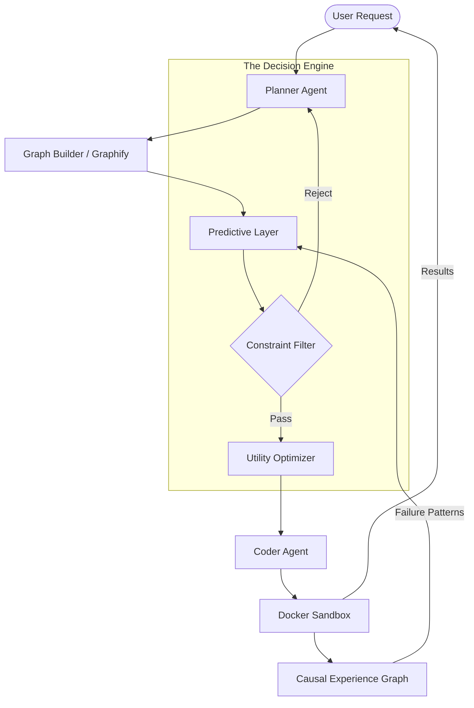

# 🪐 ECAE: Predictive Entity-Centric Autonomous Engineering

[](https://github.com/your-repo/ecae)
[](https://twitter.com/karpathy)

> **"Predict-before-write reduces regression bugs, iteration count, and compute waste compared with reactive write → fail → fix workflows."**

ECAE (pronounced *'echo'*) is a next-generation autonomous engineering core. Inspired by the architectural visions of Andrej Karpathy and the shift toward **Software 2.0**, ECAE moves beyond simple RAG-based coding assistants. It treats codebases not as strings of text, but as **Stochastic State Graphs** where every change is a transformation to be predicted and verified before a single line is committed.

---

## 🧠 The Philosophy: Beyond Reactive Coding

Most current AI agents follow a **Reactive Loop**:
`Generate → Execute → Fail → Fix → Repeat`

ECAE implements a **Predictive Loop**:
`Predict → Filter → Optimize → Generate → Execute → Learn`

By building a causal dependency graph of your codebase, ECAE identifies the "blast radius" of a proposed change. If a change to a payment utility might break a webhook listener three modules away, ECAE rejects the candidate before wasting compute or introducing a regression.

---

## 🏗️ System Architecture

ECAE is a system-level synthesis of graph program analysis, multi-objective optimization, and execution-grounded learning.



---

## 🚀 Key Features

### 1. Entity-Centric Graph Modeling
Powered by **Graphify**, the system extracts AST-level dependencies to build a directed attributed graph $G = (V, E, L)$.
- **Nodes ($V$):** Functions, APIs, Modules, Tests, Failures.
- **Edges ($E$):** Calls, Data Flow, Event Triggers.
- **Attributes ($L$):** Risk scores, test coverage, historical failure frequency.

### 2. Causal Experience Graph (CEG)
Instead of a simple chat history, ECAE maintains a **long-term engineering memory** in **Qdrant**. It stores:
- **Failure Records:** Why a change failed (the "cause").
- **Fix Patterns:** How the system eventually succeeded.
- **Skill Distillation:** Atomic, reusable engineering patterns extracted from successful evolutions.

### 3. Multi-Objective Decision Engine
ECAE doesn't just pick the first code snippet that looks right. It evaluates candidates using:
- **Pareto Optimization:** Balancing reliability, performance, and simplicity.
- **Minimax Adversarial Selection:** Testing code against a "Critic Agent" to ensure robustness in security-sensitive paths.

### 4. Self-Evolutionary "Tree-of-Thought"
When in `SELF_EVOLUTION` mode, the orchestrator spawns multiple parallel branches, simulates them in isolated containers, and scores them based on test-pass rates and architectural integrity.

---

## ⚡ Quick Start

### 1. Spin up the Memory Core
ECAE requires a vector database to store its causal memory.
```bash
docker run -d -p 6333:6333 qdrant/qdrant
```

### 2. Install the Engine
```bash
python3 -m pip install fastapi uvicorn qdrant-client sentence-transformers networkx
```

### 3. Initialize your Codebase Graph
```bash
# Update the dependency map of the current directory
PYTHONPATH=./graphify python3 -m graphify update .
```

### 4. Launch the ECAE API
```bash
uvicorn memory_system.main:app --host 0.0.0.0 --port 8000 --reload
```

---

## 🧪 Mathematical Foundation

ECAE models code transformation as a transition function on the graph state:
$$G_{t+1} = f(G_t, \Delta)$$

A change $\Delta$ is accepted only if it maximizes the Utility Function $U(\Delta)$ subject to a risk threshold $\tau$:
$$U(\Delta) = \sum w_i \cdot \phi_i(G', \Delta)$$
$$\text{subject to: } \text{risk}(\Delta) < \tau$$

---

## 📂 Project Structure

- `agent_engine/`: The "Brain" - Multi-agent state machine and Tree-of-Thought orchestrator.
- `memory_system/`: The "Memory" - Qdrant-backed RAG and semantic storage.
- `graphify/`: The "Eyes" - AST dependency extraction and graph construction.
- `paper.md`: Formal research draft of the ECAE framework.
- `ecae_lite_prototype.md`: Specification for the minimal measurable prototype.

---

## 📡 Antigravity Integration (MCP)

This project is a native **Model Context Protocol (MCP)** server. Add it to your Antigravity configuration to give your AI agent structural awareness.

To ensure clean standard output (which MCP relies on for JSON-RPC communication) and to ensure rapid handshakes, configure it carefully:

```json
{
  "mcpServers": {
    "memory-system": {
      "command": "uv",
      "args": [
        "run",
        "--with", "mcp",
        "--with", "httpx",
        "-m", "memory_system.mcp_server"
      ],
      "cwd": "/path/to/ecae/project"
    }
  }
}
```

---

## 📜 Roadmap

- [ ] **Phase 1:** Core Causal Experience Graph (CEG) implementation.
- [ ] **Phase 2:** Predictive Blast-Radius Heuristics.
- [ ] **Phase 3:** Multi-Agent Pareto Scoring.
- [ ] **Phase 4:** Autonomous Skill Extraction & Re-injection.

---

> *"The future of programming is not writing code; it's supervising the evolution of a codebase's state graph."* 
> — **ECAE Project Vision**
